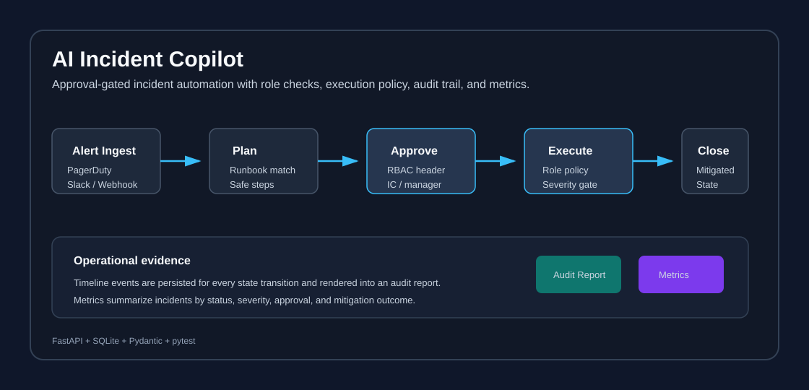

# AI Incident Copilot


An API-first incident response copilot that turns alerts into controlled mitigation workflows: ingest an incident, generate a plan, require human approval, enforce role and severity policy, execute approved actions, and retain an auditable timeline.

The project is intentionally built around **control before automation**.



## Why This Repo Matters

Operational AI tools are useful only when they are safe to run under pressure. A copilot that can jump directly from alert to action is risky. This repo shows the safer pattern: plan, approve, execute under policy, and preserve evidence for review.

It demonstrates:

- incident lifecycle state machine
- integration-style alert ingest
- deterministic mitigation plan generation
- role-based approval and execution gates
- severity-aware execution policy
- immutable-style timeline events
- audit report generation
- metrics endpoints for operational reporting
- focused tests for safety and workflow correctness

## At a Glance

| Concern | Implementation |
|---|---|
| Workflow control | `open -> planned -> approved -> executing -> mitigated` |
| Human approval | Approval endpoint requires incident commander or engineering manager role |
| Execution safety | Critical incidents require `incident_commander` execution |
| Auditability | Timeline events plus Markdown audit report per incident |
| Integrations | PagerDuty, Slack, and webhook-style ingest surface |
| Operations | Incident listing, filters, pagination, and summary metrics |

## Architecture

```text
External alert source
  -> POST /v1/integrations/{source}/ingest
  -> SQLite incident store
  -> POST /v1/incidents/{id}/plan
  -> Planner service
  -> POST /v1/incidents/{id}/approve
  -> RBAC check
  -> POST /v1/incidents/{id}/execute
  -> RBAC + severity policy
  -> timeline + audit report + metrics
```

## Quick Start

```bash
git clone https://github.com/manjeetkumar53/ai-incident-copilot.git
cd ai-incident-copilot

python3 -m venv .venv
source .venv/bin/activate
pip install -r requirements.txt

uvicorn app.main:app --reload
```

Open Swagger UI at `http://127.0.0.1:8000/docs`.

## Operational Flow

### 1. Ingest

```bash
curl -s -X POST http://127.0.0.1:8000/v1/incidents/ingest \
  -H "Content-Type: application/json" \
  -d '{
    "title":"Checkout error spike",
    "service":"checkout-api",
    "severity":"critical",
    "source":"pagerduty",
    "summary":"5xx errors crossed SLO threshold"
  }'
```

### 2. Generate Plan

```bash
curl -s -X POST http://127.0.0.1:8000/v1/incidents/<INCIDENT_ID>/plan
```

### 3. Approve

```bash
curl -s -X POST http://127.0.0.1:8000/v1/incidents/<INCIDENT_ID>/approve \
  -H "Content-Type: application/json" \
  -H "X-Role: incident_commander" \
  -d '{"approved_by":"incident-commander","comment":"Proceed with mitigation"}'
```

### 4. Execute

```bash
curl -s -X POST http://127.0.0.1:8000/v1/incidents/<INCIDENT_ID>/execute \
  -H "Content-Type: application/json" \
  -H "X-Role: incident_commander" \
  -d '{"executed_by":"incident-commander"}'
```

### 5. Review Audit Evidence

```bash
curl -s http://127.0.0.1:8000/v1/incidents/<INCIDENT_ID>/audit-report
```

## API Surface

| Endpoint | Purpose |
|---|---|
| `GET /health` | Service liveness |
| `POST /v1/incidents/ingest` | Direct incident ingest |
| `POST /v1/integrations/{source}/ingest` | PagerDuty, Slack, or webhook-style ingest |
| `POST /v1/incidents/{id}/plan` | Generate deterministic mitigation plan |
| `POST /v1/incidents/{id}/approve` | Role-gated plan approval |
| `POST /v1/incidents/{id}/execute` | Role and policy-gated execution |
| `GET /v1/incidents/{id}` | Incident detail with plan and timeline |
| `GET /v1/incidents/{id}/audit-report` | Reviewer-ready incident evidence |
| `GET /v1/incidents` | Filtered and paginated incident list |
| `GET /v1/metrics/summary` | Operational metrics summary |

## Security and Control Model

Sensitive endpoints require an `X-Role` header:

| Endpoint | Allowed roles |
|---|---|
| `POST /v1/incidents/{id}/approve` | `incident_commander`, `engineering_manager` |
| `POST /v1/incidents/{id}/execute` | `incident_commander`, `sre_oncall` |

Additional execution policy:

- critical incidents can only be executed by `incident_commander`
- execution is blocked until a plan exists
- execution is blocked unless the plan contains a `write_action`
- execution is blocked unless the incident is already approved

## Data Model

| Entity | Fields |
|---|---|
| Incident | `id`, `title`, `service`, `severity`, `source`, `summary`, `status`, timestamps |
| Plan | `incident_id`, `runbook_id`, `confidence`, `rationale`, `steps[]` |
| Step | `id`, `description`, `step_type` as `read_only` or `write_action` |
| Timeline event | `event`, `actor`, `detail`, `created_at` |

## Validation

```bash
pytest -q
pytest -q tests/test_incident_flow.py
```

The test suite validates:

- health endpoint
- happy-path lifecycle
- approval blocked until plan exists
- execution blocked until approval
- forbidden role handling
- critical incident execution policy
- integration ingest, list, and metrics behavior
- audit report generation

## Design Decisions

- **Header-based roles:** simple enough for a portfolio MVP while making control boundaries explicit.
- **SQLite store:** local persistence without external services.
- **Deterministic planner:** stable tests and predictable behavior under incident workflows.
- **Audit report endpoint:** evidence is treated as part of the product surface, not an afterthought.
- **Policy before execution:** write actions are gated by status, role, severity, and plan contents.

## Project Structure

```text
ai-incident-copilot/
├── app/
│   ├── main.py
│   ├── models.py
│   └── services/
│       ├── authz.py
│       ├── planner.py
│       ├── policy.py
│       ├── reporting.py
│       └── store.py
├── assets/demo/
├── tests/
├── requirements.txt
└── README.md
```

## Production Hardening Backlog

- Replace header-based roles with signed identity or JWT claims
- Move persistence to Postgres with migration tooling
- Execute write actions through an async job worker
- Add real PagerDuty, Slack, and deployment integrations
- Add immutable audit export and incident analytics dashboard
